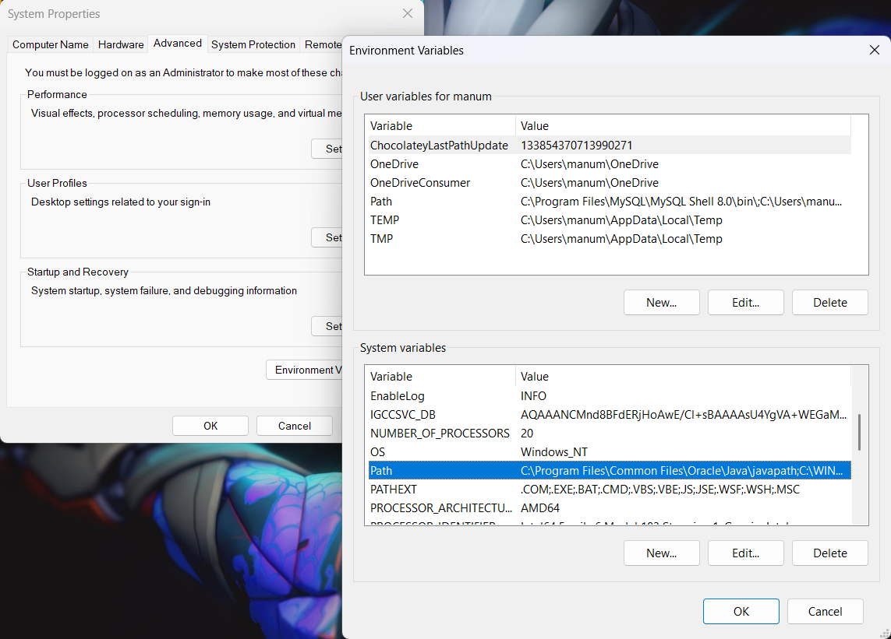
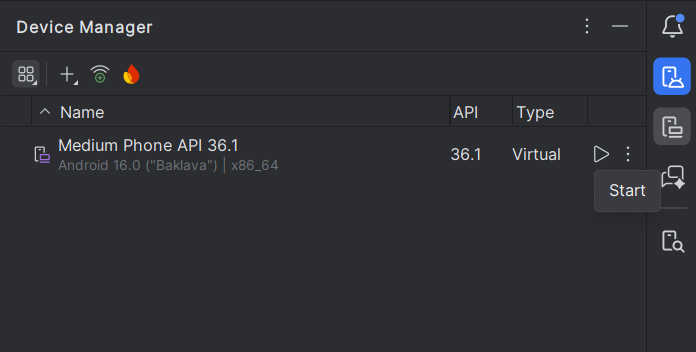

# ReadyGo
App mobile para recordatorios.

> IMPORTANT  
> Cualquier error en al instalación o preparación de la aplicación contactar a algun miembro del equipo.

## Prerequisitos
Tener instalado las siguientes aplicaciones:
- Android Studio
- Node.js
- Git

> NOTE  
> Si ya cuentas con estas aplicaciones instaladas puedes empezar con la ejecución de la aplicación.

Comprueba ejecutando estos comandos:  
```sh
# Comprueba Node.js
PS C:\Users\manuel> node -v
v22.14.0

# Comprueba Git
PS C:\Users\manuel> git -v
git version 2.48.1.windows.1

# Comprueba emulador de Android Studio
PS C:\Users\manuel> adb version
Android Debug Bridge version 1.0.41
Version 36.0.2-14143358
Installed as C:\Users\manuel\AppData\Local\Android\Sdk\platform-tools\adb.exe
Running on Windows 10.0.26100
```

### Instalación del emulador
Empieza instalando Android Studio desde la página oficial. Instala la versión mas reciente para evitar problemas.    
https://developer.android.com/studio

Una vez que finalice la instalación, en la barra de busqueda de Windows (donde buscas aplicaciones instaladas) busca: `Edit the system environment variables` y da click para abrirlo. En la esquina inferior derecha aparecera el boton de `Environment Variables...`.

En la sección de variables del sistema, da click en `New` y crea una nueva variable de entorno con la siguiente información:  
- Name: `ANDROID_HOME`
- Value: `C:\Users\{tu_nombre}\AppData\Local\Android\Sdk`

> WARNING  
> Reemplaza `{tu_nombre}` por tu usuario de Windows, con todo y las llaves.  
*e.g.*  
`C:\Users\manuel\AppData\Local\Android\Sdk`.

Ahora busca la variable `Path` y editala agregando las siguientes tres lineas:



```
%ANDROID_HOME%\platform-tools
%ANDROID_HOME%\emulator
%ANDROID_HOME%\cmdline-tools\latest\bin
```

Comprueba que todo este bien ejecutando el comando de comprobación del inicio.

## Ejecución

### Prepara el emulador
Abre Android Studio y da click en la barra lateral derecha en la sección de `Device Manager`. Da click en `Start` para el dispositivo `Medium Phone API`.



Tras unos segundos veras como se muestra una pantalla de celular dentro de Android Studio.

### Correr la aplicación

Abre VSCode o tu editor de código de preferencia, y abre la terminal del editor.  

Dirigete a la carpeta donde esta el proyecto `C:\User\...\readyGo-dismov>`.

Dentro de la carpeta empieza instalando las dependencias con `npm install`. Despues inicia la app con el siguiente comando: `npm start`.

Espera unos segundos a que cargue la aplicación en la terminal, y en la misma terminal teclea la letra `a` para descargar la app e iniciarla en el emulador.

> NOTE  
> Si aun tienes dudas, checa el siguiente video: [Tutorial](./docs/tutorial.mp4).
